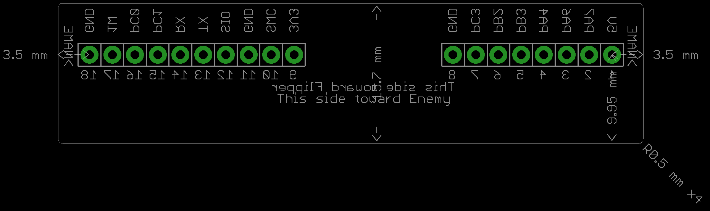

# Installation
Copy `flipper-gpio.lbr` to the system or user library folder. In EagleCAD's main menu, enable the use of the library.

# Reference Photos
## All individual Devices with Flipper_GPIO_Dimension layer turned on

## The full 18-pin Device with Measures layer turned on

## Full 18-pin non-RA Device with Measures and Flipper_GPIO_Dimension layer turned on

