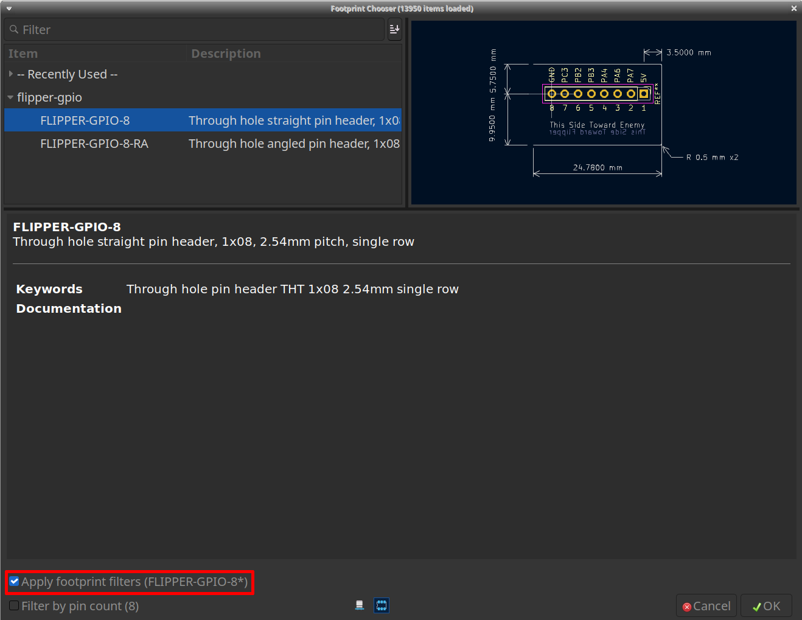
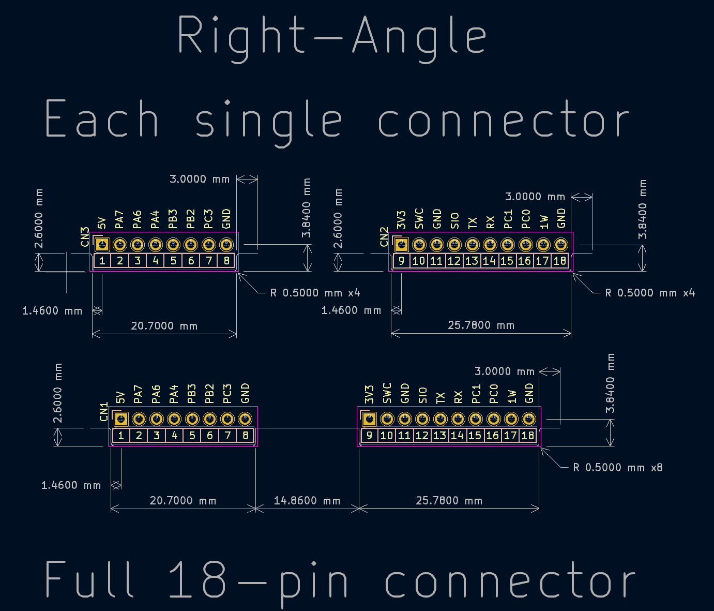
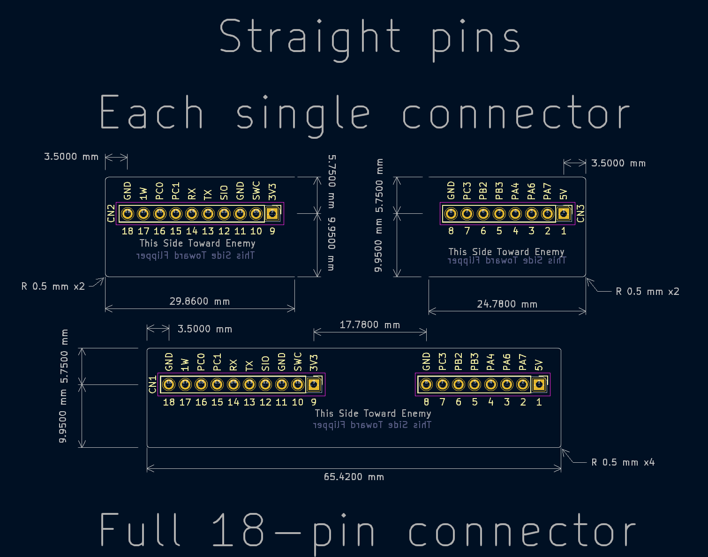
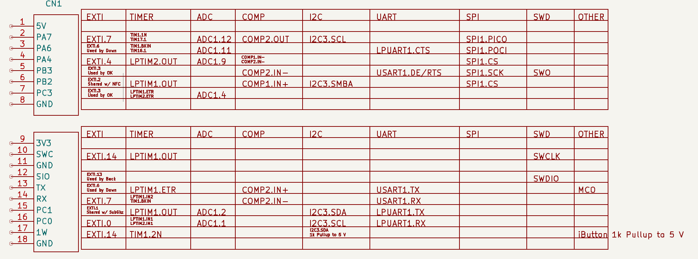

# Installation
## Schematic Symbols
- From the main KiCad menu, select `Preferences` then `Manage Symbol Libraries`
- Select either `Global Libraries` or `Project Specfic Libraries` depending on your preferences
- Select the folder icon that says `Add existing library to table`
- Navigate to this folder and select `flipper-gpio.kicad_sym`

## Footprints
- From the main KiCad menu, select `Preferences` then `Manage Footprint Libraries`
- Select either `Global Libraries` or `Project Specfic Libraries` depending on your preferences
- Select the folder icon that says `Add existing library to table`
- Navigate to this folder and select the `flipper-gpio.pretty` folder

## Use
When you place a symbol on the schematic, it defaults to the right-angle (`-RA`) variant. The straight footprint can be selected by editing the symbol properties, selecting the footprint chooser, and selecting the non-right-angle variant. Be sure to check `Apply footprint filters` in the footprint chooser to make it easier to find the correct footprints.

## Updates
Repository changes can be pulled in on your local machine, this should automatically update the files in the KiCad library.

## Notes
The footprints contain relevant outlines for the layout as recommended by Flipper Devices. These are on the `User.Drawings` layer and can be traced over on the `Edge.Cuts` layer when using them to define the board outline. Additionally, the straight pin header variants (non-right-angle) contain notes on `F.Fab` and `B.Fab` to indicate which side is toward and away from the Flipper to ensure components are not placed incorrectly.

# Reference Photos
## All Right-angle variants with `User.Drawings` enabled

## All straight pin variants with `User.Drawings` enabled

## Schematic symbol with pin MUX table

